# Olá! Eu sou Benito Marculano Ribeiro 👋

## Sobre mim

Sou desenvolvedor full stack com experiência em sistemas web, APIs REST, integrações e automações. Minha atuação concentra-se em Java e Spring Boot, Python, JavaScript e Angular, além de bancos de dados relacionais como Oracle e SQL Server.

Formado em Análise e Desenvolvimento de Sistemas pelo IFES, atualmente curso a Pós Tech AI Scientist — Ciência de Dados com IA, da FIAP. Busco transformar necessidades de negócio em soluções eficientes e bem estruturadas, participando desde o levantamento de requisitos até a entrega da aplicação.

## Tecnologias e ferramentas

<div>
  
  
  
  
  
  
  
  
  
  
  
  
  
  
  
  
  
</div>

## Contato

<div>
  <a href="https://www.linkedin.com/in/benito-marculano-ribeiro-a23018141/">
    
  </a>
  <a href="mailto:benito2016mr@gmail.com">
    
  </a>
  <a href="https://api.whatsapp.com/send?phone=5527995152815">
    
  </a>
  <a href="https://www.instagram.com/benitomarculanoribeiro/">
    
  </a>
</div>

## Certificações

### Docker — Iniciativa DevOps (2022)

<a href="https://api.badgr.io/public/assertions/elx4pD5oR8y0PpI7ZilFAg">
  
</a>

## Estatísticas do GitHub

<div align="center">
  
</div>

As estatísticas são validadas e atualizadas automaticamente após cada push na
branch `main`, uma vez por hora e também por execução manual do workflow. O
commit automático que altera somente o SVG não inicia uma nova execução.

### Desenvolvimento

Requer Node.js 20 ou superior:

```bash
npm test
npm run update-trophies
```
